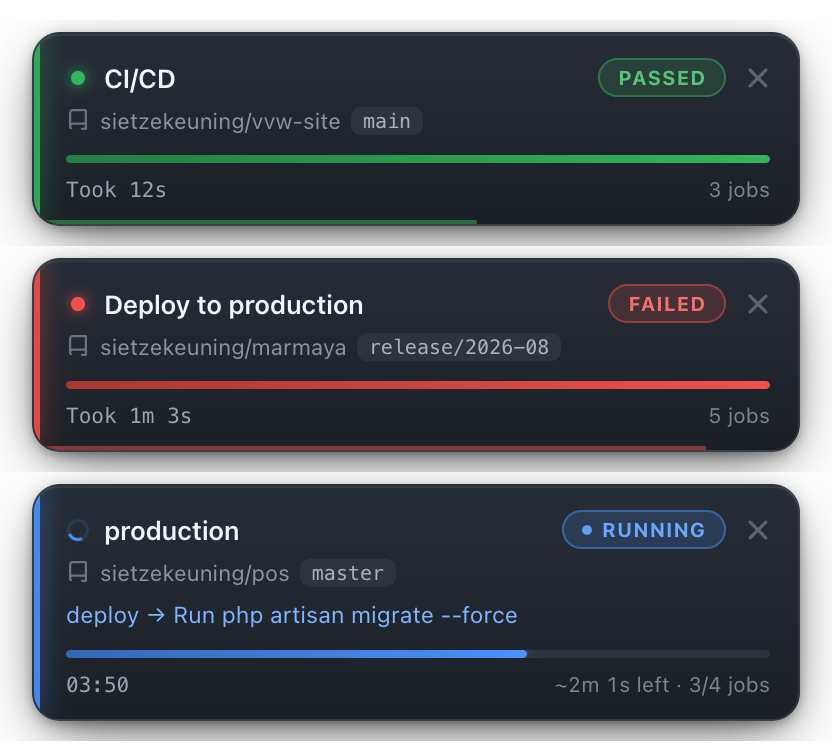
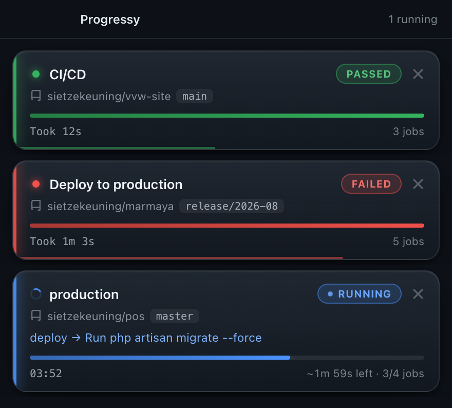

# Progressy

A small desktop app that watches your GitHub Actions and slides a card onto your screen the moment a
workflow starts — with a progress bar based on how long that workflow usually takes.

<p align="center">
  
</p>

The cards live in the top-right corner, on top of whatever you are doing. They are click-through, so
they never get in the way of the window underneath — until you move your cursor over one.

| | |
| --- | --- |
| **Live status** | The pill in the corner tracks the run: `QUEUED` → `RUNNING` → `PASSED` or `FAILED`, with the accent colour, dot and progress bar following along. |
| **Time-based progress** | The bar is measured against the median wall-clock time of the last 3 successful runs of that same workflow, so it shows `~2m 1s left` instead of a guess. No history yet? It falls back to completed jobs, or an indeterminate sweep. |
| **Current step** | The job and step that GitHub is running right now, e.g. `deploy → Run php artisan migrate --force`. |
| **Sticks around** | A finished run stays for 20 seconds — green for passed, red for failed — with a thin bar draining along the bottom edge, then slides away on its own. |
| **Dismissable** | The `×` gets rid of a card immediately. It stays gone for that run; the next run shows up as normal. |

## Install

### macOS

1. Download `Progressy-1.0.0-arm64.dmg` from the [releases](../../releases) (or build it yourself, see below).
2. Open the DMG and drag **Progressy** into **Applications**.
3. The app is not signed with an Apple Developer ID, so the first launch needs one extra step:
   right-click **Progressy** → **Open** → **Open**. (Double-clicking gives "Progressy cannot be
   opened because the developer cannot be verified".) If macOS refuses anyway, clear the quarantine
   flag:

   ```bash
   xattr -dr com.apple.quarantine /Applications/Progressy.app
   ```

4. Progressy has no dock icon — look for the menu bar icon at the top of the screen.

### Windows

1. Download and run `Progressy Setup 1.0.0.exe`, or use the portable `.exe` if you would rather not
   install anything.
2. Progressy adds itself to the startup items and lives in the system tray.

### Linux

```bash
chmod +x Progressy-1.0.0.AppImage && ./Progressy-1.0.0.AppImage
# or, on Debian/Ubuntu:
sudo dpkg -i progressy_1.0.0_amd64.deb
```

## Connect it to GitHub

On first launch Progressy asks for a Personal Access Token:

1. Go to <https://github.com/settings/tokens> → **Generate new token (classic)**.
2. Tick the **`repo`** and **`workflow`** scopes.
3. Paste the token into the login screen.

The token is stored locally (macOS: `~/Library/Application Support/progressy/config.json`) and is only
ever sent to `api.github.com`. To remove it: menu bar icon → **Disconnect**.

## Using it

- **Menu bar icon** — click it to open the window with everything that is currently running.

  

- **Cards** appear on their own whenever a run starts in one of your 5 most recently updated
  repositories. Hover one to interact with it, hit `×` to dismiss it.
- **Disconnect / Quit** live in the menu bar icon's context menu.

Progressy polls GitHub every 15 seconds and caches the expensive lookups (step details for 30
seconds, the expected duration per workflow for 30 minutes), which lands well inside GitHub's rate
limit of 5,000 requests per hour.

## Build it yourself

Requires Node 18+ and npm.

```bash
git clone git@github.com:sietzekeuning/progressy.git
cd progressy
npm install
npm run package:mac     # or package:win / package:linux
```

The installers end up in `release/`. See [BUILD.md](BUILD.md) for the full matrix and code-signing
notes.

### Development

```bash
npm run dev             # vite + electron with hot reload
PROGRESSY_DEMO=1 npm start   # fake runs, to work on the cards without waiting for CI
```

- Main process: `src/main/main.ts` — polling, run state, the popup window
- Renderer: `src/renderer/` — `views/PopupView.vue` (the stack), `components/ActionCard.vue` (a card)
- Preload bridge: `src/main/preload.ts`

## License

MIT
